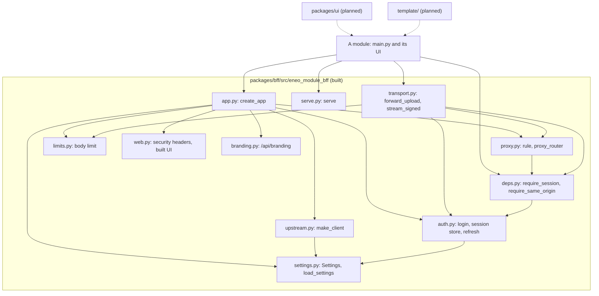
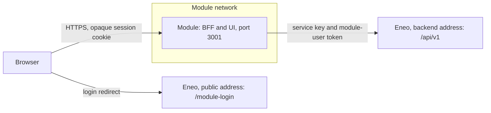
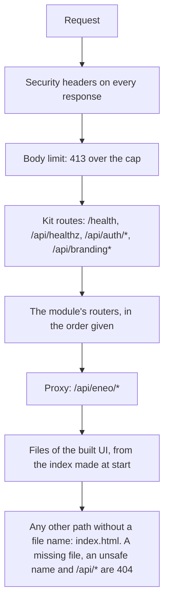
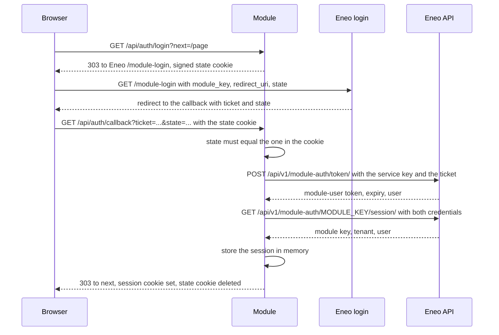
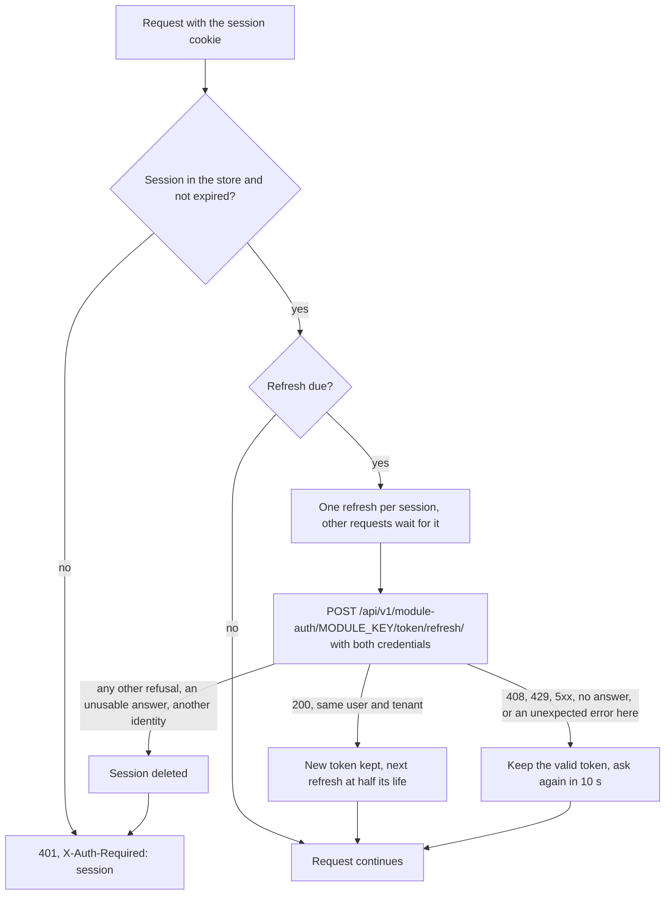
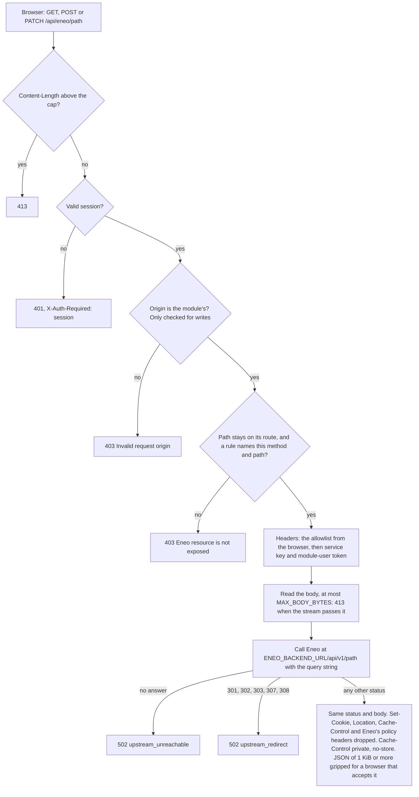
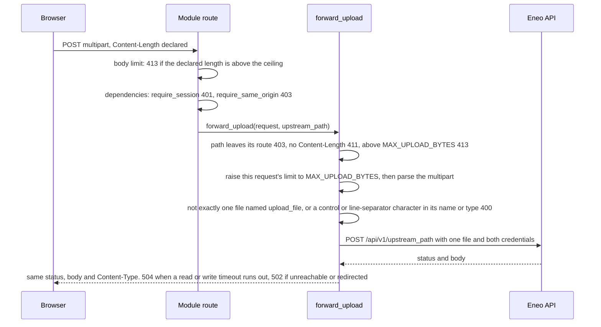
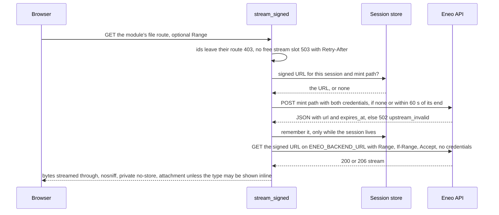
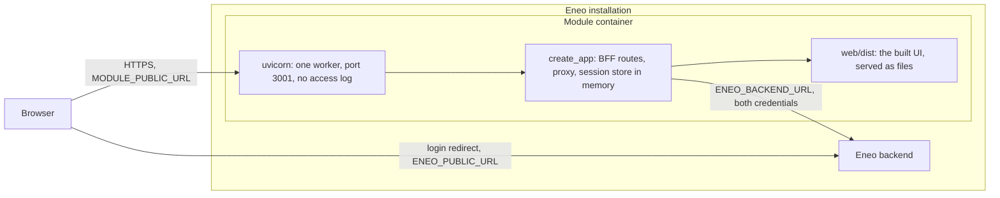

# Architecture

Purpose: show how the kit's parts fit together and how a request moves through the BFF, in diagrams that are the source of truth.
Read this when: you are starting to work on `packages/bff`, writing a module on it, or reviewing a change to login, the proxy, uploads or file streaming.
Related: [README](../README.md), [docs index](README.md), [guides](guides/build-a-module.md), [decisions](decisions/README.md), [design (long form)](design.md), [BFF package](../packages/bff/README.md), [glossary](glossary.md).

Every claim about code names the file, never a line. If a diagram and the code disagree, the code wins: fix the diagram.

## What is built

| Part | Path | Status |
|---|---|---|
| BFF package `eneo-module-bff` | `packages/bff/` | Built and tested. Version 0.1.0, not released. |
| UI package `@eneo-ai/module-kit` | `packages/ui/` | Planned. Not in the repository yet. |
| Template (the smallest working module) | `template/` | Planned. Not in the repository yet. |
| Module contract, design, decisions, guides | `docs/` | Current. |

The diagrams below describe the BFF as built, except the last one, which is the target deployment of a module made from the planned template.

## Parts and package structure

Look at: which files import which, and what a module imports from the package.

The dashed arrows are planned: a module will import the UI package and start as a copy of the template. The BFF holds the module contract with Eneo and no route of any module.

## System context

Look at: the two addresses of Eneo. The browser reaches Eneo at `ENEO_PUBLIC_URL`; the module reaches it at `ENEO_BACKEND_URL`, on the module network.

The browser never holds a credential for Eneo. See [auth](#login-handoff) below and the contract in [design.md](design.md) section 2.

## How the app is assembled

Look at: the order a request meets things. Routes match in registration order, so a module's route wins over the proxy and the page, and cannot replace a kit route. An arrow means "no earlier route matched".

Source: `packages/bff/src/eneo_module_bff/app.py` (`create_app`). Routes added to the app after `create_app` returns come after the page and are never reached: use `routers=`. The security-headers middleware is the outermost, so even the body limit's 413 carries the headers.

## Login handoff

Look at: the two cookies. The state cookie binds the login to this browser for five minutes; the session cookie is an opaque id, and the token it stands for stays in the module's memory.

| Fact | Value | Where |
|---|---|---|
| Session cookie | `eneo_module_session`, random id, HttpOnly, SameSite=Lax, `Secure` unless `COOKIE_SECURE=false`, path `/`, ends with the session | `auth.py` |
| State cookie | `eneo_module_login_state`, signed with `SESSION_SECRET`, five minutes, path `/api/auth/callback`, deleted by the callback | `auth.py` |
| Where login returns | `next` if it is a path of this module of at most 512 characters with no backslash and no control character (a tab, CR or LF would make `/<tab>/host` read as `//host`), else `Settings.home_path` (default `/`) | `auth.py` (`module_path`) |
| Callback failure | 303 to `/?auth_error=<code>`: `invalid_state`, `exchange_unavailable`, `exchange_failed`, `exchange_invalid`, `validation_unavailable`, `validation_failed`, `validation_invalid` | `auth.py` |
| Session end | `min(SESSION_MAX_AGE_MINUTES, Eneo's session_expires_at)` | `auth.py` |
| A new login | Ends the session the browser held | `auth.py` (`callback`) |
| Renewal (`?renew=true`) | Binds the login to the user signed in now. No session left: 303 to `next` with `fel=utgangen`. Another user signs in: the old session is kept and the page gets `fel=annan-anvandare` | `auth.py` |

## Session lifecycle and refresh

Look at: the three outcomes of a refresh. Only a refusal from Eneo ends the session; an Eneo that cannot answer does not.

A refresh is due at half the token's lifetime, and only while a new token could outlive the current one (the current one does not already reach the session end). `GET /api/auth/status` reports `refresh_in` and `session_ends_in`, so a page that sends no other request can ask again in time. A logout during a refresh stays a logout. Source: `auth.py` (`ModuleAuth._live_session`, `_refresh`, `_refresh_token`).

## A proxied request

Look at: the order of the checks. Nothing reaches Eneo until the session, the origin and the allowlist have each said yes.

Source: `proxy.py` (`proxy_router`, `leaves_route`, `FORWARDED_REQUEST_HEADERS`) and `limits.py`. A path that could reach another Eneo route (a `.` or `..` segment written or percent-encoded, `?`, `#`, a control character, a backslash) is a 403 before any rule is tried.

## Uploads

Look at: where the body is first read. An upload route has no `File(...)` parameter, so `Depends(require_session)` has run before one byte of the body is read.

Source: `transport.py` (`forward_upload`) and `limits.py`. The read timeout and the write timeout of the call to Eneo are each `UPLOAD_PROXY_TIMEOUT_SECONDS`, lowered (never below 60 s) by the request's `X-Upload-Timeout-Seconds` header. They are per phase, as for every call: no total deadline bounds an upload.

## Signed files

Look at: what the browser never sees. Eneo's signed URL is a bearer URL to the file; the module mints it, keeps it with the session, and streams the bytes through.

Source: `transport.py` (`stream_signed`) and `auth.py` (`ModuleSessionStore.signed_url`). Eneo's answer is closed when the response ends, however it ends (the file finished, an error in the body, the browser left, a cancellation): in a `finally` around the whole response, shielded from the cancellation and bounded at 2 s, and a failing close is logged and changes nothing. The stream slot is returned after the close. At most `MAX_CONCURRENT_STREAMS` files stream at once. An entry in the session store ends with its session: logout, expiry, a refresh that ends it, or a new login.

## Target deployment

Look at: one container, one process, one replica. This is the deployment the planned template builds. The BFF half is built: `serve()` fixes one worker and turns the access log off.

| Fact | Status |
|---|---|
| `serve()` runs one uvicorn worker, no access log (the callback URL carries a ticket), WebSocket buffers bounded, stops within 8 s of SIGTERM | Built (`serve.py`) |
| Port 3001, `GET /health` answers `{"ok": true}` | Built (`serve.py`, `app.py`) |
| One container on the module network, no outbound internet | Contract from [design.md](design.md) section 2 |
| Dockerfile: Node builds `web/dist`, a Python slim runtime image with no Node, non-root, `HEALTHCHECK` on `/health` | Planned (template) |
| Sessions are process-local: one replica. More needs sticky sessions or a shared store | Decided when a module needs it |

## Where each fact lives

| Topic | File in `packages/bff/src/eneo_module_bff/` | Tests in `packages/bff/tests/` |
|---|---|---|
| Settings and start-up validation | `settings.py` | `test_settings.py` |
| Login, session store, refresh, same-origin | `auth.py` | `test_auth.py` |
| Route dependencies | `deps.py` | `test_deps.py` |
| Proxy, allowlist, `leaves_route` | `proxy.py` | `test_proxy.py` |
| Uploads and signed files | `transport.py` | `test_transport.py` |
| Body limit | `limits.py` | `test_limits.py` |
| The client to Eneo (no cookies, bounded answers), the paths and headers sent to it | `upstream.py`, `proxy.py` | `test_upstream_client.py`, `test_upstream_answers.py`, `test_upstream_paths.py`, `test_mint_answers.py` |
| Where login returns | `auth.py` | `test_login_redirect.py` |
| Security headers, built UI | `web.py` | `test_web.py` |
| Branding routes | `branding.py` | `test_branding.py` |
| App factory | `app.py` | `test_app.py` |
| Running the server | `serve.py` | `test_serve.py`, `test_shutdown.py` |
| Public names and version | `__init__.py` | `test_serve.py` (the names), `test_package.py` (the version) |
